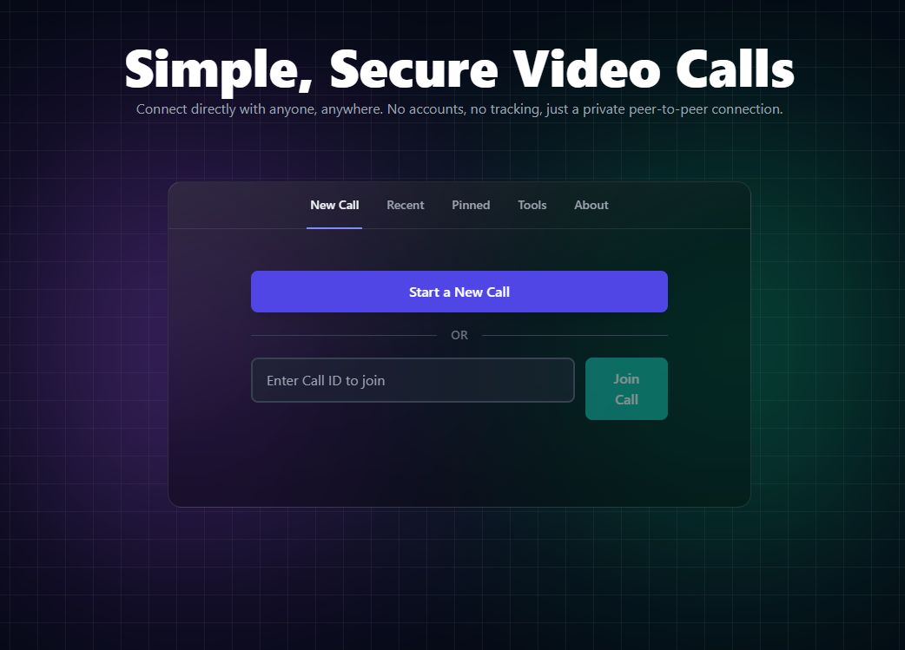

# 🎥 Secure P2P Video Call

<div align="center">

[](https://p2p-call-9efe5.web.app)

**[🚀 Launch Live Demo](https://p2p-call-9efe5.web.app)**

*Simple, secure peer-to-peer video calling with optional end-to-end encryption*


</div>

---

## ✨ Features

### 🔐 Privacy & Security
- **No Account Required** - Start calling instantly, completely anonymous
- **No Tracking** - Your data stays yours, no analytics or tracking
- **End-to-End Encryption** - Optional AES-GCM 256-bit encryption for ultimate privacy
- **Direct P2P Connection** - Video/audio streams directly between browsers
- **Secure by Default** - HTTPS enforced, comprehensive security headers

### 📞 Calling Features
- **Human-Readable Call IDs** - Easy-to-share format like "happy-river-sings"
- **Direct Peer Ringing** - Call saved contacts without sharing call IDs
- **Call History** - Track recent calls with custom aliases
- **Pinned Contacts** - Save frequent contacts for quick access
- **Presence System** - See when contacts are online
- **Multiple Resolutions** - 480p, 720p, 1080p video quality options

### 💬 In-Call Features
- **Real-time Chat** - Text messaging during calls
- **Connection Stats** - Live packet loss, jitter, RTT, and bitrate monitoring
- **Auto-Reconnection** - Automatic recovery from network issues
- **Floating Video** - Draggable remote video window
- **Audio Feedback** - Sound cues for call events

### 🌐 Progressive Web App
- **Installable** - Add to home screen on mobile and desktop
- **Offline Ready** - Service worker for offline capability
- **Responsive Design** - Works perfectly on all devices
- **Dark Mode** - Beautiful dark theme with glassmorphism effects

## 🏗️ Architecture

### Technology Stack
- **Frontend**: React 19, TypeScript, Tailwind CSS
- **Real-time**: WebRTC for peer connections
- **Signaling**: Firebase Realtime Database
- **Authentication**: Firebase Anonymous Auth
- **Build Tool**: Vite
- **Testing**: Vitest + Testing Library
- **PWA**: Service Worker + Web App Manifest

### How It Works

1. **Call Creation**: Caller generates a unique, human-readable call ID
2. **Signaling**: WebRTC offer/answer exchange via Firebase
3. **Connection**: Direct peer-to-peer connection established using STUN/TURN servers
4. **Encryption** (Optional): AES-GCM encryption applied to media streams
5. **Communication**: Video, audio, and data channels for chat

```
┌─────────┐                 ┌──────────┐                 ┌─────────┐
│ Caller  │ ←─── WebRTC ───→ │ Firebase │ ←─── WebRTC ──→ │ Joiner  │
│         │   (Signaling)    │ Database │   (Signaling)   │         │
└─────────┘                  └──────────┘                 └─────────┘
     │                                                          │
     └───────────── Direct P2P Media Stream ──────────────────┘
              (Video, Audio, Chat - Optionally Encrypted)
```

## 📋 Usage

### Creating a Call
1. Click **"Start a New Call"**
2. Configure media settings in the lobby
3. Toggle end-to-end encryption if desired
4. Click **"Start Call"**
5. Share the call ID with your contact

### Joining a Call
1. Enter the call ID you received
2. Click **"Join Call"**
3. Review your media in the lobby
4. Click **"Join"** to connect

### Direct Ringing
1. Add contacts to your **Pinned** list
2. See when they're online
3. Click their name to ring them directly
4. They receive an incoming call notification

## 🔒 Security Features

- **Firebase Security Rules** - Comprehensive database protection
- **Anonymous Authentication** - Secure without personal data
- **HTTPS Enforcement** - Automatic redirect to secure connection
- **Security Headers** - HSTS, CSP, X-Frame-Options, etc.
- **Error Boundary** - Graceful error handling
- **Input Validation** - Call ID format validation
- **E2EE Implementation** - Per-frame encryption with unique IVs

## 🌟 Key Highlights

- ⚡ **Lightning Fast** - Optimized bundle size with tree-shaking
- 🎨 **Beautiful UI** - Modern design with smooth animations
- 📱 **Mobile-First** - Responsive design that works everywhere
- 🔌 **Offline Capable** - Service worker for offline functionality
- 🧪 **Well Tested** - Unit tests with Vitest
- 📚 **Well Documented** - Comprehensive guides and documentation
- 🛡️ **Production Ready** - Security hardened and optimized

## 📱 Browser Support

| Browser | Minimum Version | E2EE Support |
|---------|----------------|--------------|
| Chrome/Edge | 90+ | ✅ Yes |
| Firefox | 90+ | ✅ Yes |
| Safari | 15.4+ | ⚠️ Limited |
| Mobile Chrome | 90+ | ✅ Yes |
| Mobile Safari | 15.4+ | ⚠️ Limited |

**Note**: E2EE requires Insertable Streams API support

## 🤝 Contributing

Contributions are welcome! Please feel free to submit a Pull Request.

## 📄 License

This project is licensed under the MIT License - see the [LICENSE](LICENSE) file for details.

## 🙏 Acknowledgments

- **WebRTC** - For enabling peer-to-peer communication
- **Firebase** - For providing real-time signaling infrastructure
- **React** - For the robust UI framework
- **Tailwind CSS** - For the utility-first styling approach
- **Open Relay Project** - For free TURN servers

## 🎯 Roadmap

- [ ] Screen sharing support
- [ ] Group calls (3+ participants)
- [ ] Call recording (local)
- [ ] Virtual backgrounds
- [ ] Noise suppression
- [ ] Background blur
- [ ] Improved mobile UI
- [ ] Multi-language support

## 📊 Project Stats

- **Bundle Size**: ~85 KB (gzipped)
- **Test Coverage**: Growing
- **Load Time**: < 2s on 3G

---

<div align="center">

**Built with ❤️ using React and WebRTC**

[Live Demo](https://p2p-call-9efe5.web.app) • [Report Bug](https://github.com/yourusername/p2p-call/issues)

</div>
